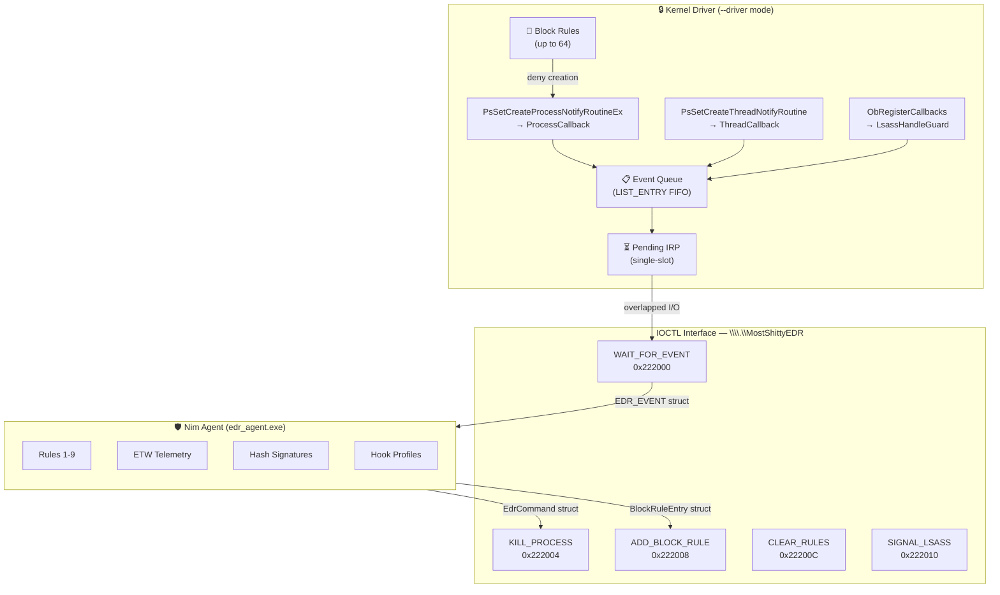

<div align="center">


</div>
<br><br>

# MostShittyEDR

### *The World's Most Intentionally Terrible Endpoint Detection & Response Agent*

[](https://nim-lang.org/)
[](LICENSE)
[](https://www.microsoft.com/windows)
[](README.md)

**An educational EDR agent built in Nim with an optional kernel driver for learning detection techniques and their bypasses.**

[Features](#features) • [Quick Start](#quick-start) • [Driver Mode](#kernel-driver-mode) • [Challenges](#the-challenge) • [Architecture](#architecture) • [EDR Explained](https://benjitrapp.github.io/MostShittyEDR/edr-explained/) • [Resources](#resources)

</div>

---

## Overview

**MostShittyEDR** is a deliberately weak EDR agent designed for **security research**, **education**, and **red team training**. It implements detection methods that mirror real-world EDR engines but with intentional weaknesses mapped to **39 bypass challenges** across **10 categories**.

The project has two operating modes:
- **User-mode** (default) — polls processes via Toolhelp32 snapshots
- **Kernel-mode** (`--driver`) — receives real-time events from a kernel driver via IOCTLs, with kernel-level process blocking, LSASS handle protection, and hardware-enforced kill

> *"If you can't bypass this, you definitely need more practice"*

> :warning: **Disclaimer**: This is NOT production security software. It's an educational tool for understanding EDR evasion techniques.

---

## Features

<table>
<tr>
<td width="50%">

### 9 Detection Rules

| Rule | Method | Action |
|------|--------|--------|
| 1 | Process Name Blacklist (12 names) | **BLOCKS** |
| 2 | Command Line Keywords (substring) | **BLOCKS** |
| 3 | Reconnaissance Detection | `discard` |
| 4 | LSASS Dump Detection (dual condition) | **BLOCKS** |
| 5 | PowerShell Analysis (flags) | **BLOCKS** |
| 6 | Hash-Based Detection (SHA256, `--signatures`) | **BLOCKS** |
| 7 | Hooked API Import Detection (`--profile`) | **ALERTS** |
| 8 | ETW Integrity Check | **BLOCKS** |
| 9 | PE Structure Analysis (packer/header) | **ALERTS** |

</td>
<td width="50%">

### Technical Features

- **Dual-mode monitoring**
  - User-mode: Toolhelp32 snapshot polling
  - Kernel-mode: driver callbacks via `--driver`

- **Kernel driver integration**
  - Process/thread creation callbacks
  - LSASS handle guard (ObRegisterCallbacks)
  - Kernel-level process blocking & termination
  - Overlapped I/O with async event delivery

- **EDR hook profiles**
  - Real hook data from CrowdStrike, Carbon Black, Cylance, Bitdefender, Cortex, Checkpoint

- **ETW telemetry**
  - Custom ETW provider & trace session
  - Integrity monitoring (tamper detection)

</td>
</tr>
</table>

---

## Quick Start

### Prerequisites

- Windows 10/11 (64-bit)
- [Nim 2.0+](https://nim-lang.org/) with MinGW

```powershell
winget install nim-lang.Nim
```

### Build & Run

```powershell
# Install dependencies and build
make build

# Or manually:
nimble install winim -y
nim c -d:release --opt:size -o:edr_agent.exe src/edr_agent.nim

# Run in detection-only mode
.\edr_agent.exe --verbose --no-kill

# Run with hash signatures
.\edr_agent.exe --verbose --signatures signatures/malware_hashes.txt

# Run with EDR hook profile
.\edr_agent.exe --verbose --profile crowdstrike

# Run with kernel driver (requires loaded driver + admin)
.\edr_agent.exe --driver --verbose
```

### Command-Line Options

| Flag | Description |
|------|-------------|
| `--verbose`, `-v` | Show all new processes (not just detections) |
| `--no-kill`, `-n` | Detect but don't terminate processes |
| `--interval MS` | Set polling interval in ms (default: 500, min: 50) |
| `--profile NAME` | Load EDR hook profile for Rule 7 |
| `--signatures FILE` | Load SHA256 hash signatures for Rule 6 |
| `--driver` | Connect to kernel driver for real-time monitoring |
| `--no-etw` | Disable ETW telemetry provider and Rule 8 |
| `--list-profiles` | Show available hook profiles |

### Lab Usage

```powershell
# Terminal 1: Start the EDR agent
.\edr_agent.exe --verbose --no-kill --signatures signatures/malware_hashes.txt

# Terminal 2: Try to execute commands without being detected
whoami          # This WILL be detected (Rule 3, but discarded)
mimikatz.exe    # This WILL be blocked (Rule 1)
# Can you find a way that won't be?
```

---

## Kernel Driver Mode

The `--driver` flag connects the agent to the kernel driver (`\\.\MostShittyEDR`) for real-time, event-driven monitoring instead of user-mode polling.

### What the driver provides

- **Process creation callbacks** via `PsSetCreateProcessNotifyRoutineEx` — every process start/exit is observed
- **Thread creation callbacks** via `PsSetCreateThreadNotifyRoutine` — thread lifecycle events
- **LSASS handle protection** via `ObRegisterCallbacks` — strips `PROCESS_VM_READ` and `PROCESS_QUERY_INFORMATION` from LSASS handles
- **Kernel-level block rules** — the agent pushes block rules (process name + command-line patterns) to the kernel, which can deny process creation before it starts
- **Kernel-level process termination** — uses `ZwTerminateProcess` from ring 0 instead of user-mode `TerminateProcess`

### Communication protocol

The agent communicates with the driver via 5 IOCTLs over `\\.\MostShittyEDR`:

| IOCTL | Code | Direction | Purpose |
|-------|------|-----------|---------|
| `WAIT_FOR_EVENT` | `0x222000` | Kernel → Agent | Agent blocks until next event (overlapped I/O) |
| `KILL_PROCESS` | `0x222004` | Agent → Kernel | Kernel-level process termination |
| `ADD_BLOCK_RULE` | `0x222008` | Agent → Kernel | Push block rule (image suffix + cmdline substr) |
| `CLEAR_BLOCK_RULES` | `0x22200C` | Agent → Kernel | Reset all block rules |
| `SIGNAL_LSASS_DUMP` | `0x222010` | Agent → Kernel | Signal LSASS dump — kernel kills dumper + logs event |

### Driver setup

```powershell
# Use the install script (requires Administrator)
.\install_driver.ps1 -Install

# Or manually:
# 1. Enable test-signing (one-time, requires reboot)
bcdedit /set testsigning on

# 2. Register and start the driver
sc.exe create MostShittyEDR type= kernel binPath= C:\path\to\driver.sys
sc.exe start MostShittyEDR

# 3. Run the agent with --driver
.\edr_agent.exe --driver --verbose

# Uninstall
.\install_driver.ps1 -Uninstall
```

### User-mode vs Kernel-mode

| | User-mode (default) | Kernel-mode (`--driver`) |
|---|---|---|
| **Monitoring** | Toolhelp32 polling (500ms gaps) | Kernel callbacks (no gaps) |
| **Process blocking** | Kill after detection | Deny creation before start |
| **LSASS protection** | Keyword matching only | Handle permission stripping |
| **Process termination** | `TerminateProcess` (user-mode) | `ZwTerminateProcess` (ring 0) |
| **Evasion difficulty** | Easy (timing, elevation) | Harder (needs kernel access) |
| **Requirements** | None | WDK, test-signing, Administrator |

---

## The Challenge

> **Can you bypass the EDR?**
> This agent uses common detection patterns found in real-world EDR products.
> Your mission: Execute tools and commands without being detected or killed!

### Known Vulnerabilities

- :unlock: Case-sensitive blacklist (`Mimikatz.exe` != `mimikatz.exe`)
- :unlock: No command-line deobfuscation (carets, env vars, encoding all bypass)
- :unlock: Recon detection is theater (Rule 3 detects but discards the result)
- :unlock: LSASS rule needs dual match (rename tool OR omit "lsass" keyword)
- :unlock: Only monitors `powershell.exe` (not `pwsh.exe`)
- :unlock: Plaintext signature file is readable and exact-match only
- :unlock: Static import analysis bypassed by dynamic resolution or direct syscalls
- :unlock: ETW session has hardcoded name, patchable `EtwEventWrite`
- :unlock: PE analysis has no entropy check, strict parser crashes on corrupted headers
- :unlock: Polling-based monitoring has timing gaps (without `--driver`)

### Challenge Categories

| Category | Challenges | Difficulty | Target Rules |
|----------|-----------|-----------|--------------|
| **Process Name Evasion** | 01-04 | Easy | Rule 1 |
| **Command Line Obfuscation** | 05-09 | Easy-Medium | Rules 2, 3, 5 |
| **Process Monitoring Bypass** | 10-14 | Medium | Architecture, Rule 4 |
| **Execution Evasion** | 15-18 | Medium-Hard | Architecture, Rule 5 |
| **Advanced Bypass** | 19-20 | Easy-Hard | Architecture, Rule 6 |
| **API Hook Evasion** | 21-24 | Medium-Hard | Rule 7 |
| **ETW Bypass** | 25-28 | Easy-Hard | Rule 8 |
| **Signature Bypass** | 29-32 | Easy-Hard | Rule 6 |
| **Packer & PE Evasion** | 33-36 | Medium-Hard | Rule 9 |
| **BYOVD / Kernel Attacks** | 37-39 | Hard | Kernel Driver |

**39 challenges** with full solutions at the [Challenge Browser](https://benjitrapp.github.io/MostShittyEDR/challenges/).

---

## Architecture

### Detection Pipeline

```
Process Event (polling or kernel callback)
    |
    +-> Rule 1: Process Name Blacklist   --> KILL   (case-sensitive!)
    +-> Rule 2: Command Line Keywords    --> KILL   (no deobfuscation!)
    +-> Rule 3: Recon Detection          --> discard (never blocks!)
    +-> Rule 4: LSASS Dump Detection     --> KILL   (needs both conditions!)
    +-> Rule 5: PowerShell Analysis      --> KILL   (only powershell.exe!)
    +-> Rule 6: Hash Check (SHA256)      --> KILL   (exact match, on-disk only!)
    +-> Rule 7: Hooked API Imports       --> ALERT  (static imports only!)
    +-> Rule 8: ETW Integrity            --> KILL   (user-mode only!)
    +-> Rule 9: PE Structure Analysis    --> ALERT  (no entropy, strict parser!)
```

### Dual-Mode Architecture



### Project Structure

```
MostShittyEDR/
├── src/
│   ├── edr_agent.nim              # User-mode EDR agent (Nim)
│   └── driver/
│       └── driver.cpp             # Kernel driver (C++, WDK required)
├── tests/
│   ├── test_rules.nim             # 98 rule + ABI verification tests
│   ├── test_profiles.nim          # 20 hook profile tests
│   ├── test_driver_logic.cpp      # 44 driver logic tests (user-mode)
│   └── test_driver_ioctl.cpp      # Driver IOCTL integration tests
├── profiles/                      # Real EDR hook profiles
├── signatures/
│   └── malware_hashes.txt         # SHA256 signature database
├── _challenges/                   # 39 bypass challenges
├── _solutions/                    # Detailed solution walkthroughs
├── install_driver.ps1             # Driver install/uninstall script
├── Makefile                       # Build automation
└── MostShittyEDR.nimble           # Nim package config
```

---

## Testing

```powershell
# Run all Nim tests (rules + profiles)
make test-nim

# Run driver logic tests (no driver needed)
make test-driver-logic

# Run driver IOCTL tests (requires loaded driver + admin)
make test-driver-ioctl

# Run all safe tests
make test
```

The test suite includes **162 tests**:
- 98 detection rule tests (Rules 1-9, helpers, analysis engine)
- 24 driver ABI verification tests (struct sizes, field offsets, IOCTL codes)
- 20 hook profile tests
- 20 driver logic tests (C++)

---

## Resources

### EDR Internals
- [EDR Explained (MostShittyEDR)](https://benjitrapp.github.io/MostShittyEDR/edr-explained/) - How real EDRs work
- [Understanding and Attacking EDRs](https://benjitrapp.github.io/attacks/2024-08-21-edr-and-malware/) - Deep dive into hooking, syscalls, and kernel bypass
- [EDR Bypass Roadmap](https://benjitrapp.github.io/attacks/2026-01-18-EDR-bypass-roadmap/) - Strategic approach to bypassing EDR
- [BYOVD & IOCTL EDR Killer](https://benjitrapp.github.io/attacks/2026-06-24-byovd-ioctl-edr-killer/) - Killing EDR agents via vulnerable driver IOCTLs
- [ETW-TI Deep Dive](https://benjitrapp.github.io/defenses/2026-06-19-etw-ti/) - Kernel-level telemetry defense
- [Breaking ETW and EDR](https://benjitrapp.github.io/attacks/2024-02-11-offensive-etw/) - Offensive ETW techniques

### Companion Projects
- [MostShittyAV](https://github.com/BenjiTrapp/MostShittyAV) - The AMSI bypass companion lab (43 challenges)

### Security Research
- [MITRE ATT&CK - Defense Evasion](https://attack.mitre.org/tactics/TA0005/)
- [LOLBAS Project](https://lolbas-project.github.io/) - Living Off The Land Binaries
- [Mr-Un1k0d3r/EDRs](https://github.com/Mr-Un1k0d3r/EDRs) - EDR hook data (used for profiles)
- [Astral-PE](https://github.com/DosX-dev/Astral-PE) - PE header obfuscation (Challenge 35)
- [NimBlackout](https://github.com/Helixo32/NimBlackout) - Nim BYOVD process killer (Challenge 37)
- [EDRSandblast](https://github.com/wavestone-cdt/EDRSandblast) - Kernel callback removal & ETW-TI blinding (Challenges 38-39)

---

## License

This project is licensed under the MIT License - see the [LICENSE](LICENSE) file for details.

---

## :warning: Legal Notice

**This tool is for educational and research purposes only.**

- :x: Do not use on systems you don't own or have explicit permission to test
- :x: Do not use for malicious purposes
- :x: Not a replacement for real endpoint security
- :white_check_mark: Use in controlled lab environments only
- :white_check_mark: Understand applicable laws and regulations in your jurisdiction

**The author assumes no liability for misuse of this software.**

---

<div align="center">

### Happy Hunting!

*Made with Nim for the security research community*

**[:star: Star this repo](../../stargazers)** • **[:bug: Report Bug](../../issues)** • **[:bulb: Request Feature](../../issues)**

</div>
