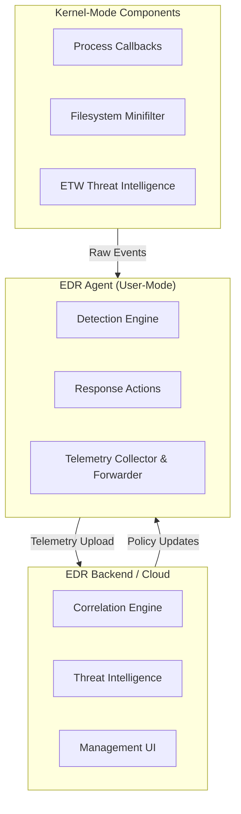
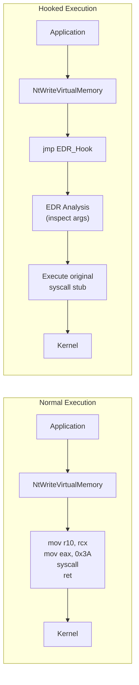

# EDR Explained: Endpoint Detection & Response

Modern EDR solutions are the frontline defense against advanced threats on endpoints. They combine multiple detection layers, from user-mode hooking to kernel-level telemetry, to identify and respond to malicious activity in real time. This page explains how they work, why they're effective, and where their weaknesses lie.

* * *

## What is an EDR?

An **Endpoint Detection & Response (EDR)** system is a security solution that continuously monitors endpoint activity, collects telemetry, and applies detection logic to identify threats. Unlike traditional antivirus that relies solely on signatures, EDRs combine behavioral analysis, kernel-level visibility, and centralized correlation to detect attacks that signatures miss.

**Key differences from traditional AV:**

- **AV** scans files at rest, while **EDR** monitors behavior in real time
- **AV** relies on known signatures, while **EDR** uses behavioral heuristics and correlation
- **AV** operates mostly in user-space, while **EDR** hooks deep into the kernel
- **AV** blocks or quarantines, while **EDR** detects, responds, AND provides forensic context

* * *

## EDR Architecture

A typical enterprise EDR consists of four core components working together:

| Component | Role | Examples |
|-----------|------|----------|
| **EDR Agent** | User-mode process that coordinates sensors, applies detection logic, and reports to the backend | CrowdStrike Falcon Sensor, SentinelOne Agent, Defender for Endpoint |
| **Sensors** | Components that observe system activity and convert events into telemetry | Kernel callbacks, minifilters, ETW consumers, API hooks |
| **Telemetry** | Raw event data representing system activity | Process creation, file writes, network connections, registry changes |
| **Detections** | Logic that correlates telemetry into threat verdicts | Signature rules, behavioral models, YARA rules, ML classifiers |

### High-Level Architecture



* * *

## How Detection Works (Step by Step)

1. **Event occurs:** A process is created, a file is written, or a network connection is opened
2. **Kernel sensor fires:** A registered callback or minifilter captures the raw event
3. **Telemetry is generated:** The event is normalized into a structured data point
4. **Agent receives telemetry:** The user-mode agent collects events from all sensors
5. **Detection logic runs:** Rules, heuristics, and ML models evaluate the event in context
6. **Verdict is reached:** Clean, suspicious, or malicious
7. **Response executes:** Alert, block, quarantine, isolate, or kill the process
8. **Telemetry is forwarded:** Events and verdicts are sent to the cloud backend for correlation

* * *

## Kernel-Level Sensors

The kernel is where EDRs gain their deepest visibility. These are the primary kernel mechanisms:

### Process & Thread Callbacks

Windows provides kernel notification routines that fire on every process/thread lifecycle event:

| Callback | Purpose |
|----------|---------|
| `PsSetCreateProcessNotifyRoutineEx` | Notified on every process creation/exit, with the ability to block creation |
| `PsSetCreateThreadNotifyRoutine` | Notified on every thread creation/exit |
| `PsSetLoadImageNotifyRoutine` | Notified on every image (DLL/EXE) load |
| `ObRegisterCallbacks` | Intercepts handle operations (e.g., protect LSASS handles) |
| `CmRegisterCallbackEx` | Monitors registry operations |

These callbacks fire **in kernel context**, meaning they cannot be evaded by user-mode techniques alone.

### Filesystem Minifilters

Minifilters monitor all filesystem I/O through the Filter Manager framework:

- **Pre-operation callbacks** inspect and can block operations before they execute
- **Post-operation callbacks** inspect results after completion
- **Altitude-based ordering** uses a numerical altitude to determine execution order

**Common EDR minifilter altitudes:**

| Vendor | Driver | Altitude |
|--------|--------|----------|
| Microsoft Defender | WdFilter.sys | 328010 |
| CrowdStrike | csagent.sys | 321410 |
| SentinelOne | sentinelmonitor.sys | 389040 |
| Elastic | ElasticEndpoint.sys | 385100 |
| Carbon Black | cbk7.sys | 385200 |

### ETW Threat Intelligence

**Event Tracing for Windows (ETW)** provides high-fidelity telemetry directly from the kernel:

- `Microsoft-Windows-Threat-Intelligence` fires on memory allocation, process hollowing, and code injection
- Operates from `ntoskrnl.exe` kernel callbacks and is immune to user-mode tampering
- Cannot be disabled without kernel-level access (unlike regular ETW sessions)

* * *

## User-Mode Hooking

EDRs inject DLLs into every process and hook critical Windows API functions in `ntdll.dll`:

### How Hooking Works



### Hooking Methods

| Method | Technique | Detection Scope |
|--------|-----------|-----------------|
| **Inline Hooking** | Overwrites first bytes of ntdll functions with `jmp` to EDR code | Most common; intercepts all calls through ntdll |
| **IAT Hooking** | Modifies Import Address Table entries | Catches statically linked imports only |
| **Hardware Breakpoints** | Uses CPU debug registers (DR0-DR3) | Stealthy, limited to 4 breakpoints |
| **Trampoline Hooks** | Redirects via allocated code caves | Common variant of inline hooking |

* * *

## Syscall Stubs & Direct Syscalls

The transition from user-mode to kernel-mode happens through **syscall stubs** in `ntdll.dll`:

```asm
; Normal syscall stub (x64) for NtWriteVirtualMemory
NtWriteVirtualMemory:
    mov r10, rcx            ; Save first parameter
    mov eax, 0x3A           ; Syscall number (version-specific!)
    syscall                 ; Transition to kernel
    ret                     ; Return to caller
```

EDRs hook these stubs by replacing the first bytes with a `jmp`. Bypass techniques resolve the syscall number (SSN) dynamically and invoke `syscall` directly, skipping the hooked stub entirely.

**Resolution techniques:**

- **Hell's Gate** reads SSNs from neighboring unhooked stubs
- **Halos Gate** extends Hell's Gate with fallback resolution
- **Tartarus Gate** handles multiple consecutive hooked functions
- **SysWhispers** provides compile-time SSN resolution from version tables

* * *

## Detection Categories

### Signature-Based

Compares file hashes (MD5, SHA-256) or byte patterns against known malware databases.

**Strengths:** Fast, accurate for known threats, low false positives
**Weaknesses:** Zero detection of new/modified malware, trivially bypassed by recompilation

### Behavioral / Heuristic

Monitors execution patterns rather than static file properties:

- Process injection chains (alloc → write → create thread)
- Credential access patterns (LSASS handle with specific access rights)
- Lateral movement indicators (remote service creation, WMI execution)
- Living-off-the-land abuse (suspicious PowerShell, certutil downloads)

### Machine Learning

Classifies files and behaviors using trained models:

- Static ML on PE features (imports, sections, entropy)
- Dynamic ML on execution traces
- Anomaly detection on process trees

* * *

## Response Actions

When a detection fires, the EDR can take graduated response actions:

| Action | Severity | Description |
|--------|----------|-------------|
| **Log** | Low | Record event for forensic review |
| **Alert** | Medium | Notify SOC analysts |
| **Block** | High | Prevent the operation from completing |
| **Kill** | Critical | Terminate the malicious process |
| **Isolate** | Critical | Disconnect endpoint from network (except EDR comms) |
| **Remediate** | Critical | Remove artifacts, roll back changes |

* * *

## Known EDR Weaknesses (Architectural)

Even well-implemented EDRs have structural limitations:

### 1. User-Mode Hooks Are Bypassable

Hooks in `ntdll.dll` exist in the process's own address space. An attacker with code execution can:
- Unhook by restoring original bytes from a clean ntdll copy
- Use direct/indirect syscalls to bypass hooks entirely
- Load a second ntdll from disk (`KnownDlls` or manual mapping)

### 2. Timing Windows

Kernel callbacks are not instantaneous and brief windows exist:
- Between process creation and hook initialization
- Between thread creation and callback registration
- Poll-based agents have gaps between scans

### 3. Kernel Trust Boundary

If an attacker gains kernel access (e.g., via BYOVD, Bring Your Own Vulnerable Driver):
- Callbacks can be unregistered
- Minifilters can be detached
- ETW providers can be disabled
- The EDR agent itself can be terminated

### 4. Blind Spots

- **Pre-existing processes** that were running before the EDR starts are not re-scanned
- **32-bit processes on 64-bit** systems are harder to monitor due to the WoW64 layer
- **Encrypted/packed content** cannot be analyzed because the EDR cannot read it
- **Fileless attacks** executing only in memory avoid filesystem minifilters

### 5. Cloud Dependency

- Offline endpoints lose cloud correlation and updated threat intelligence
- Network-level blocking (firewall, proxy) can blind the backend
- Tools like **EDRSilencer** block telemetry upload via WFP rules

* * *

## How MostShittyEDR Implements (and Fails at) These Concepts

This lab deliberately implements each EDR concept in the weakest possible way:

| Real EDR Feature | MostShittyEDR Implementation | Why It's Weak |
|-----------------|------------------------------|---------------|
| Kernel callbacks | User-mode polling (Toolhelp32) | Timing gaps, no kernel visibility |
| Behavioral detection | Substring matching on command lines | No deobfuscation, no context |
| Hash database | Empty hash set | Literally zero entries |
| Process blocking | Case-sensitive name blacklist | Rename = bypass |
| LSASS protection | Dual-condition keyword match | Either condition alone = bypass |
| PowerShell analysis | Checks `powershell.exe` only | `pwsh.exe` is invisible |
| ETW telemetry | Not implemented | Complete blind spot |
| Response actions | `discard` on recon detection | Detects but never acts |

* * *

## EDR Bypass Categories

These are the primary categories of techniques used to evade EDR detection:

| Category | Technique | Complexity |
|----------|-----------|-----------|
| **Unhooking** | Restore original ntdll bytes from clean copy | Medium |
| **Direct Syscalls** | Invoke syscall instruction directly, skipping hooks | Medium |
| **Indirect Syscalls** | Jump to syscall instruction inside ntdll (avoids direct syscall detection) | Hard |
| **BYOVD** | Load vulnerable signed driver for kernel access | Hard |
| **Early Injection** | Inject before hooks are placed (Early Bird, Process Ghosting) | Hard |
| **ETW Blinding** | Patch ETW functions to suppress telemetry | Medium |
| **Minifilter Detach** | Unload or detach filesystem minifilters | Hard |
| **Callback Removal** | Enumerate and remove kernel notification callbacks | Hard |
| **Telemetry Blocking** | Block EDR network communication via firewall/WFP | Easy |

* * *

## PatchGuard & Kernel Integrity

**Kernel Patch Protection (PatchGuard)** prevents unauthorized modification of kernel structures:

- Periodically verifies integrity of SSDT, IDT, GDT, and kernel code
- Triggers `CRITICAL_STRUCTURE_CORRUPTION` (bug check 0x109) on tampering
- Protects against SSDT hooking, which forces EDRs to use supported callback APIs instead
- Does NOT protect dynamically registered callbacks (EDR's own callback pointers)

This is why modern EDRs use `PsSetCreateProcessNotifyRoutineEx` instead of SSDT hooks. PatchGuard allows the callback-based approach.

* * *

## Further Reading

- [Understanding and Attacking EDRs](https://benjitrapp.github.io/attacks/2024-08-21-edr-and-malware/) for a deep dive into EDR internals and attack surfaces
- [EDR Hook Detection](https://benjitrapp.github.io/attacks/2026-06-19-edr-hook-detection/) for automated hook identification
- [Offensive ETW](https://benjitrapp.github.io/attacks/2024-02-11-offensive-etw/) on attacking Event Tracing for Windows
- [EDR Bypass Roadmap](https://benjitrapp.github.io/attacks/2026-01-18-EDR-bypass-roadmap/) for a strategic approach to bypassing EDR
- [ETW Threat Intelligence](https://benjitrapp.github.io/defenses/2026-06-19-etw-ti/) on kernel-level telemetry defense
- [MostShittyEDR Challenges](/MostShittyEDR/challenges/) to practice bypassing a deliberately weak EDR
